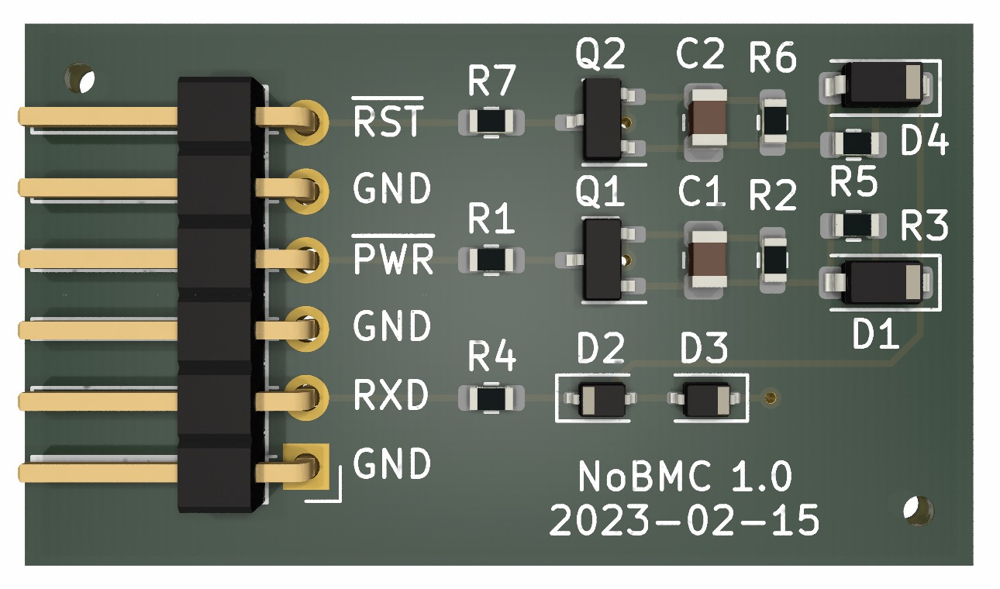

# NoBMC

Remote management interfaces offered by off-the-shelf servers are invariably
clunky, unreliable and a security horror show. Can we retrofit something
better?

Despite the feature incontinence of vendor BMCs, their only useful
interfaces are the power/reset controls and the serial-over-LAN console,
which allows remote access to the UEFI BIOS setup menus, the UEFI shell and
the console of a running Linux system.

When serial-over-LAN redirection is disabled, the same serial console is
instead available through the RS232 port. Extending this with the ability
to reliably reset the host and control power would turn it into a clean but
complete remote management solution.

## Design

Electrically, RS232 is a simple bit stream where the line is driven positive
between +3V and +15V for a logical 0, and negative between -3V and -15V for
a logical 1. 8-bit bytes are preceded by a start bit (always 0) and
followed by one or two stop bits (always 1). When idle, the line is driven
negative, corresponding to logical 1.

Thus during normal operation, a serial line is never continuously positive
for more than 90% of the time because it must fall negative for stop bits
and when idle. The otherwise-invalid constant positive state is a *serial
break* which is typically used to represent an out-of-band exception such
as a modem disconnect.

Breaks are easy to detect without decoding a serial stream or even knowing
its baud rate and other parameters. Charge a capacitor slowly through a
resistor when the line is high and discharge it quickly through a parallel
diode when the line is low. The charge potential only exceeds the positive
gate threshold of an *n*-channel MOSFET during a break of sufficient
duration; otherwise it stays negative and the MOSFET remains off regardless
of serial traffic.

The following simple circuit implements this idea, using breaks of different
lengths to control the reset and power buttons of a server from its serial
console input.

{:style="width: 100%; max-width: 40rem"}
{:style="text-align: center"}

Component values are chosen so a standard 250ms break on RXD will pull RST
to ground. If it continues beyond 550-600ms, PWR will also be pulled down.

The additional load on RXD from the 10kΩ input impedance should be
negligible, but when the serial console is disconnected or tri-stated, the
discharge resistors and 1-2V MOSFET gate thresholds protect against
unintended triggers from stray charge or noise.

## Implementation

The 35mm x 20mm board rendered below is available from
[the project repository](https://github.com/arachsys/nobmc)
in [KiCad format](https://github.com/arachsys/nobmc/tree/master/kicad).

{:style="width: 100%; max-width: 36rem"}
{:style="text-align: center"}

Inside a server, connect the GND and RXD pins of NoBMC to the GND and RXD
lines of the console serial port, pins 5 and 2 on the 9-pin male RS232
connector respectively. Neatly tapping into them can be tricky on some
motherboards.

We assume the power and reset buttons are normally open and pull an
active-low input down to ground when closed. This is true for all of our
servers but isn't formally required, so it's vital to check your own
motherboard with a multimeter. Identify the ground and input lines for each
button before connecting to the remaining GND, PWR and RST pins of NoBMC
appropriately, leaving the physical buttons connected too.

Although the serial console can still be used normally, sending a standard
250ms break will now reset the machine. Longer breaks can be used for power
control. If the usual four-second power-off delay is enabled in the BIOS, a
medium-length 600ms break will ensure the machine is switched on and reset
it, whereas a long 4600ms+ break will ensure it is switched off.

## Notes

To send a 250ms break from a POSIX host, use `tcsendbreak(fd, 0)`. There is
no portable way to adjust the length, but on Linux `ioctl(fd, TCSBRKP, k)`
sends a break of length 100*k* ms. The tempting `duration` argument of
`tcsendbreak()` is not portable: even glibc and musl interpret it
differently.

For more explicit control, `ioctl(fd, TIOCSBRK)` begins a break condition on
a serial line and `ioctl(fd, TIOCCBRK)` clears it. These work across Linux,
FreeBSD, NetBSD and OpenBSD.

In GNU Screen, the `break` command is mapped by default to `C-a b` and sends
a 250ms break. With an optional numeric argument *k*, the break will be of
length 250*k* ms.

A 100ms break is too short to trigger NoBMC so this can be used to send the
Linux "magic SysRq key" over a serial interface for kernel debugging.

We use FTDI FT232R and FT231X cables whose outputs cleanly tri-state on
power-up until fully initialised, so there is no risk of spurious
characters or serial breaks when the cable is unplugged or the management
host is power-cycled or rebooted. Your mileage may vary with other USB
serial cables. The unique serial numbers of FTDI chips are also very handy
for disambiguating multiple consoles managed by a single host.

## Contact

Please send comments, bug reports or suggestions to Chris Webb
\<[chris@arachsys.com](mailto:chris@arachsys.com)>.
